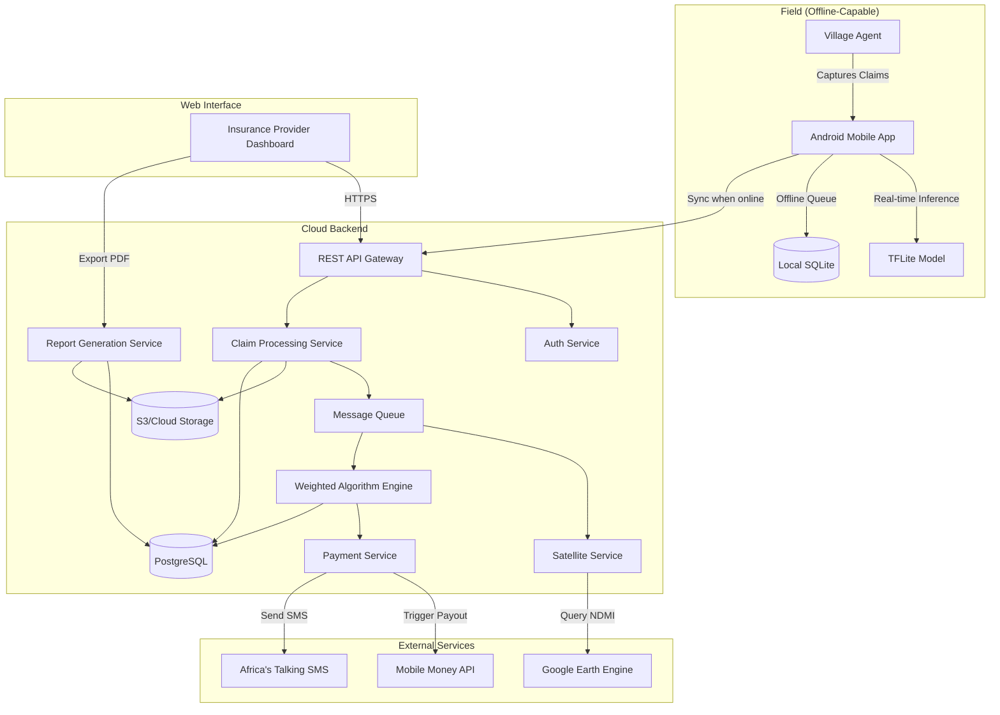

# Design Document: MavunoSure Platform

## Overview

MavunoSure is a distributed claim verification platform consisting of three main components:

1. **Android Mobile App** - Offline-first application for Village Agents with embedded TFLite ML model
2. **Backend API Services** - Python services handling claim processing, satellite data integration, and weighted verification
3. **Web Dashboard** - React-based interface for Insurance Providers to review claims and generate reports

The system implements a "Double-Lock" verification mechanism combining on-device Computer Vision (Ground Truth) with satellite-based remote sensing (Space Truth) to achieve cost-effective, fraud-resistant claim verification.

## Architecture

### High-Level System Architecture



### Technology Stack

**Mobile App (Android)**
- Language: Kotlin
- UI Framework: Jetpack Compose
- ML Framework: TensorFlow Lite 2.x
- Local Storage: Room (SQLite wrapper)
- Networking: Retrofit + OkHttp
- Camera: CameraX API
- Location: Google Play Services Location API
- Encryption: Android Keystore + AES-256

**Backend Services**
- Primary Language: Python 3.11+ (FastAPI)
- Satellite Processing: Python with Google Earth Engine API
- Authentication: Firebase Auth or custom JWT
- Database: PostgreSQL 15+
- File Storage: AWS S3 or Google Cloud Storage
- Message Queue: Redis + Celery for async tasks
- API Documentation: OpenAPI 3.0 (auto-generated by FastAPI)

**Web Dashboard**
- Framework: React 18+ with TypeScript
- State Management: React Query + Zustand
- UI Components: shadcn/ui or Material-UI
- PDF Generation: react-pdf or server-side with ReportLab
- Charts: Recharts or Chart.js
- Authentication: Firebase Auth SDK

**Infrastructure**
- Containerization: Docker
- Orchestration: Docker Compose (MVP) / Kubernetes (Production)
- CI/CD: GitHub Actions
- Monitoring: Sentry for error tracking
- Logging: Structured JSON logs with ELK stack (optional)

## Components and Interfaces

### 1. Mobile App Components

#### 1.1 Authentication Module
```kotlin
interface AuthRepository {
    suspend fun sendOTP(phoneNumber: String): Result<String>
    suspend fun verifyOTP(phoneNumber: String, otp: String): Result<AuthToken>
    suspend fun refreshToken(): Result<AuthToken>
    fun isSessionValid(): Boolean
}
```

**Implementation Details:**
- Store auth tokens in Android Keystore for security
- Implement token refresh logic with 7-day offline grace period
- Use WorkManager to schedule token refresh when online

#### 1.2 Farm Registration Module
```kotlin
data class Farm(
    val id: String,
    val farmerName: String,
    val farmerId: String,
    val phoneNumber: String,
    val cropType: CropType,
    val gpsCoordinates: GeoPoint,
    val gpsAccuracy: Float,
    val registeredAt: Instant
)

interface FarmRepository {
    suspend fun registerFarm(farm: Farm): Result<Farm>
    suspend fun getFarmById(id: String): Result<Farm>
    suspend fun searchFarmsByFarmerId(farmerId: String): Result<List<Farm>>
}
```

**GPS Handling:**
- Use FusedLocationProviderClient for best accuracy
- Implement location accuracy threshold checks (< 10m ideal, warn at > 20m)
- Store both polygon and center-point (use center-point for MVP)
- Cache last known location for faster subsequent captures

#### 1.3 Smart Snap Camera Module
```kotlin
data class CameraValidation(
    val isTiltValid: Boolean,
    val isGpsValid: Boolean,
    val tiltAngle: Float,
    val distanceFromFarm: Float
)

data class InferenceResult(
    val primaryClass: CropCondition,
    val confidence: Float,
    val topThreeClasses: List<Pair<CropCondition, Float>>,
    val inferenceTimeMs: Long
)

interface SmartCameraController {
    fun startPreview()
    fun validateCaptureConditions(farmGps: GeoPoint): CameraValidation
    suspend fun captureAndInfer(): Result<Pair<Bitmap, InferenceResult>>
    fun stopPreview()
}
```

**Anti-Fraud Checks:**
- Tilt Check: Use SensorManager to get device orientation, block if < 45°
- GPS Fence: Calculate haversine distance, block if > 50m from farm
- Time Lock: Disable gallery picker, only allow real-time capture
- Metadata Collection: Capture tilt, azimuth, GPS, timestamp with each photo

**TFLite Integration:**
- Load model from assets on app startup
- Use GPU delegate if available for faster inference
- Implement image preprocessing: resize to 224x224, normalize to [-1, 1]
- Run inference on background thread to avoid UI blocking
- Target inference time: < 2 seconds on mid-range devices

#### 1.4 Offline Queue Module
```kotlin
data class ClaimPacket(
    val claimId: String,
    val agentId: String,
    val farmId: String,
    val farmGps: GeoPoint,
    val timestamp: Instant,
    val groundTruth: GroundTruthData,
    val imageUri: String,
    val syncStatus: SyncStatus
)

data class GroundTruthData(
    val mlClass: CropCondition,
    val mlConfidence: Float,
    val topThreeClasses: List<Pair<CropCondition, Float>>,
    val deviceTilt: Float,
    val deviceAzimuth: Float,
    val captureGps: GeoPoint
)

interface OfflineQueueRepository {
    suspend fun enqueueClaim(claim: ClaimPacket): Result<Unit>
    suspend fun getPendingClaims(): List<ClaimPacket>
    suspend fun syncClaim(claimId: String): Result<Unit>
    suspend fun markSynced(claimId: String): Result<Unit>
}
```

**Implementation Details:**
- Use Room database for local persistence
- Encrypt claim data using AES-256 with key stored in Android Keystore
- Compress images to JPEG with 80% quality, max dimension 1024px
- Use WorkManager with network constraint for auto-sync
- Implement exponential backoff for failed sync attempts

### 2. Backend API Components

#### 2.1 API Gateway Structure
```
POST   /api/v1/auth/send-otp
POST   /api/v1/auth/verify-otp
POST   /api/v1/auth/refresh-token

POST   /api/v1/farms
GET    /api/v1/farms/:id
GET    /api/v1/farms/search?farmerId=:id

POST   /api/v1/claims
GET    /api/v1/claims/:id
GET    /api/v1/claims?agentId=:id&status=:status
PATCH  /api/v1/claims/:id/status

GET    /api/v1/reports/:claimId/pdf
POST   /api/v1/reports/batch
```

#### 2.2 Claim Processing Service
```python
from pydantic import BaseModel
from datetime import datetime
from enum import Enum

class CropCondition(str, Enum):
    HEALTHY = "healthy"
    DROUGHT = "drought_stress"
    DISEASE_BLIGHT = "northern_leaf_blight"
    DISEASE_RUST = "common_rust"
    PEST_ARMYWORM = "fall_armyworm"
    OTHER = "other"

class GroundTruth(BaseModel):
    image_url: str
    ml_class: CropCondition
    ml_confidence: float
    top_three_classes: list[tuple[CropCondition, float]]
    device_tilt: float
    device_azimuth: float
    capture_gps: dict[str, float]

class ClaimCreate(BaseModel):
    agent_id: str
    farm_id: str
    farm_gps: dict[str, float]
    timestamp_created: datetime
    ground_truth: GroundTruth
    image_data: bytes  # Base64 encoded

class ClaimService:
    async def create_claim(self, claim: ClaimCreate) -> str:
        """
        1. Validate claim data
        2. Upload image to S3
        3. Store claim in PostgreSQL
        4. Enqueue satellite verification task
        5. Return claim_id
        """
        pass
    
    async def get_claim(self, claim_id: str) -> Claim:
        pass
    
    async def update_claim_status(self, claim_id: str, status: str) -> None:
        pass
```

#### 2.3 Satellite Verification Service
```python
import ee
from datetime import datetime, timedelta

class SatelliteVerdict(str, Enum):
    SEVERE_STRESS = "severe_stress"
    MODERATE_STRESS = "moderate_stress"
    NORMAL = "normal"

class SpaceTruth(BaseModel):
    ndmi_value: float
    ndmi_14day_avg: float
    observation_date: datetime
    cloud_cover_pct: float
    verdict: SatelliteVerdict

class SatelliteService:
    def __init__(self):
        ee.Initialize()
    
    async def verify_claim(self, lat: float, lng: float, claim_date: datetime) -> SpaceTruth:
        """
        1. Query Sentinel-2 L2A collection
        2. Filter by date range (claim_date ± 3 days)
        3. Filter by cloud cover < 20%
        4. Calculate NDMI: (B8A - B11) / (B8A + B11)
        5. Compare to 14-day moving average
        6. Return verdict
        """
        point = ee.Geometry.Point([lng, lat])
        
        # Get recent image
        recent = ee.ImageCollection('COPERNICUS/S2_SR_HARMONIZED') \
            .filterBounds(point) \
            .filterDate(claim_date - timedelta(days=3), claim_date + timedelta(days=3)) \
            .filter(ee.Filter.lt('CLOUDY_PIXEL_PERCENTAGE', 20)) \
            .sort('CLOUDY_PIXEL_PERCENTAGE') \
            .first()
        
        # Calculate NDMI
        ndmi = recent.normalizedDifference(['B8A', 'B11'])
        ndmi_value = ndmi.reduceRegion(
            reducer=ee.Reducer.mean(),
            geometry=point.buffer(50),  # 50m buffer
            scale=20
        ).get('nd').getInfo()
        
        # Get 14-day baseline
        baseline = ee.ImageCollection('COPERNICUS/S2_SR_HARMONIZED') \
            .filterBounds(point) \
            .filterDate(claim_date - timedelta(days=17), claim_date - timedelta(days=3)) \
            .filter(ee.Filter.lt('CLOUDY_PIXEL_PERCENTAGE', 20)) \
            .map(lambda img: img.normalizedDifference(['B8A', 'B11'])) \
            .mean()
        
        ndmi_14day_avg = baseline.reduceRegion(
            reducer=ee.Reducer.mean(),
            geometry=point.buffer(50),
            scale=20
        ).get('nd').getInfo()
        
        # Determine verdict
        if ndmi_value < -0.2:
            verdict = SatelliteVerdict.SEVERE_STRESS
        elif ndmi_value < -0.1:
            verdict = SatelliteVerdict.MODERATE_STRESS
        else:
            verdict = SatelliteVerdict.NORMAL
        
        return SpaceTruth(
            ndmi_value=ndmi_value,
            ndmi_14day_avg=ndmi_14day_avg,
            observation_date=recent.get('system:time_start').getInfo(),
            cloud_cover_pct=recent.get('CLOUDY_PIXEL_PERCENTAGE').getInfo(),
            verdict=verdict
        )
```

#### 2.4 Weighted Algorithm Engine
```python
class ClaimStatus(str, Enum):
    PENDING = "pending"
    AUTO_APPROVED = "auto_approved"
    FLAGGED_FOR_REVIEW = "flagged_for_review"
    REJECTED = "rejected"
    PAID = "paid"

class WeightedVerificationResult(BaseModel):
    score: float
    status: ClaimStatus
    explanation: str
    ground_truth_confidence: float
    space_truth_confidence: float

class WeightedAlgorithm:
    GROUND_TRUTH_WEIGHT = 0.6
    SPACE_TRUTH_WEIGHT = 0.4
    
    def verify(self, ground_truth: GroundTruth, space_truth: SpaceTruth) -> WeightedVerificationResult:
        """
        Implements the weighted verification matrix from PRD Section 4
        """
        gt_conf = ground_truth.ml_confidence
        st_conf = self._satellite_confidence(space_truth)
        
        # Apply contextual rules first
        rule_result = self._apply_contextual_rules(ground_truth, space_truth)
        if rule_result:
            return rule_result
        
        # Calculate weighted score
        score = (gt_conf * self.GROUND_TRUTH_WEIGHT) + (st_conf * self.SPACE_TRUTH_WEIGHT)
        
        if score > 0.8:
            status = ClaimStatus.AUTO_APPROVED
            explanation = "High confidence from both Ground Truth and Space Truth"
        elif score >= 0.5:
            status = ClaimStatus.FLAGGED_FOR_REVIEW
            explanation = "Moderate confidence - requires human review"
        else:
            status = ClaimStatus.REJECTED
            explanation = "Low confidence score"
        
        return WeightedVerificationResult(
            score=score,
            status=status,
            explanation=explanation,
            ground_truth_confidence=gt_conf,
            space_truth_confidence=st_conf
        )
    
    def _satellite_confidence(self, space_truth: SpaceTruth) -> float:
        """Convert satellite verdict to confidence score"""
        if space_truth.verdict == SatelliteVerdict.SEVERE_STRESS:
            return 0.9
        elif space_truth.verdict == SatelliteVerdict.MODERATE_STRESS:
            return 0.6
        else:
            return 0.3
    
    def _apply_contextual_rules(self, gt: GroundTruth, st: SpaceTruth) -> WeightedVerificationResult | None:
        """
        Implements the verification matrix from PRD Section 4
        """
        # Rule 1: Drought + Low Moisture = Auto-Approve
        if gt.ml_class == CropCondition.DROUGHT and st.ndmi_value < -0.2:
            return WeightedVerificationResult(
                score=0.95,
                status=ClaimStatus.AUTO_APPROVED,
                explanation="Double confirmation: Visual drought stress matches severe satellite moisture deficit",
                ground_truth_confidence=gt.ml_confidence,
                space_truth_confidence=0.9
            )
        
        # Rule 2: Drought + Normal Moisture = Flag
        if gt.ml_class == CropCondition.DROUGHT and st.verdict == SatelliteVerdict.NORMAL:
            return WeightedVerificationResult(
                score=0.65,
                status=ClaimStatus.FLAGGED_FOR_REVIEW,
                explanation="Possible localized drought or camera fraud - satellite shows normal moisture",
                ground_truth_confidence=gt.ml_confidence,
                space_truth_confidence=0.3
            )
        
        # Rule 3: Disease + Normal Moisture = Auto-Approve
        if gt.ml_class in [CropCondition.DISEASE_BLIGHT, CropCondition.DISEASE_RUST]:
            return WeightedVerificationResult(
                score=0.85,
                status=ClaimStatus.AUTO_APPROVED,
                explanation="Disease detected - satellite may not show immediate moisture impact",
                ground_truth_confidence=gt.ml_confidence,
                space_truth_confidence=0.5
            )
        
        # Rule 4: Healthy + Low Moisture = Reject
        if gt.ml_class == CropCondition.HEALTHY and st.ndmi_value < -0.1:
            return WeightedVerificationResult(
                score=0.2,
                status=ClaimStatus.REJECTED,
                explanation="Contradiction: Crop appears healthy but satellite shows moisture stress - possible bare soil reading",
                ground_truth_confidence=gt.ml_confidence,
                space_truth_confidence=0.9
            )
        
        # Rule 5: Weed/Other = Reject
        if gt.ml_class == CropCondition.OTHER:
            return WeightedVerificationResult(
                score=0.0,
                status=ClaimStatus.REJECTED,
                explanation="Invalid subject matter - not a valid crop condition",
                ground_truth_confidence=gt.ml_confidence,
                space_truth_confidence=0.0
            )
        
        return None  # No contextual rule applies, use weighted score
```

#### 2.5 Payment Service
```python
class PaymentService:
    def __init__(self, mobile_money_api, sms_api):
        self.mobile_money = mobile_money_api
        self.sms = sms_api
    
    async def process_payout(self, claim_id: str, farmer_phone: str, amount: float) -> bool:
        """
        1. Trigger mobile money payment
        2. Retry up to 3 times with exponential backoff
        3. Send SMS notification on success
        4. Flag for manual processing on failure
        """
        max_retries = 3
        for attempt in range(max_retries):
            try:
                # Trigger payment (simulated for MVP)
                payment_result = await self.mobile_money.send_payment(
                    phone=farmer_phone,
                    amount=amount,
                    reference=claim_id
                )
                
                if payment_result.success:
                    # Send SMS notification
                    await self.sms.send_message(
                        to=farmer_phone,
                        message=f"MavunoSure: Your claim for KES {amount:,.2f} has been approved."
                    )
                    return True
                
            except Exception as e:
                if attempt < max_retries - 1:
                    await asyncio.sleep(2 ** attempt)  # Exponential backoff
                else:
                    # Flag for manual processing
                    await self.flag_for_manual_payout(claim_id)
                    return False
        
        return False
```

#### 2.6 Report Generation Service
```python
from reportlab.lib.pagesizes import A4
from reportlab.platypus import SimpleDocTemplate, Paragraph, Image, Table
from reportlab.lib.styles import getSampleStyleSheet

class ReportService:
    async def generate_claim_pdf(self, claim_id: str) -> bytes:
        """
        Generate comprehensive PDF report for a claim
        """
        # Fetch claim data
        claim = await self.claim_repo.get_claim(claim_id)
        
        # Create PDF
        buffer = BytesIO()
        doc = SimpleDocTemplate(buffer, pagesize=A4)
        story = []
        styles = getSampleStyleSheet()
        
        # Title
        story.append(Paragraph(f"MavunoSure Claim Report - {claim.claim_id}", styles['Title']))
        
        # Farmer Information
        story.append(Paragraph("Farmer Information", styles['Heading2']))
        farmer_data = [
            ["Farmer Name", claim.farmer_name],
            ["Farmer ID", claim.farmer_id],
            ["Phone Number", claim.phone_number],
            ["Farm GPS", f"{claim.farm_gps['lat']}, {claim.farm_gps['lng']}"]
        ]
        story.append(Table(farmer_data))
        
        # Ground Truth Section
        story.append(Paragraph("Ground Truth Assessment", styles['Heading2']))
        story.append(Image(claim.ground_truth.image_url, width=400, height=300))
        
        gt_data = [
            ["Classification", claim.ground_truth.ml_class],
            ["Confidence", f"{claim.ground_truth.ml_confidence:.2%}"],
            ["Top 3 Classes", self._format_top_classes(claim.ground_truth.top_three_classes)],
            ["Device Tilt", f"{claim.ground_truth.device_tilt}°"],
            ["Capture Time", claim.timestamp_created.isoformat()]
        ]
        story.append(Table(gt_data))
        
        # Space Truth Section
        story.append(Paragraph("Space Truth Assessment", styles['Heading2']))
        st_data = [
            ["NDMI Value", f"{claim.space_truth.ndmi_value:.3f}"],
            ["14-Day Average", f"{claim.space_truth.ndmi_14day_avg:.3f}"],
            ["Verdict", claim.space_truth.verdict],
            ["Observation Date", claim.space_truth.observation_date.isoformat()],
            ["Cloud Cover", f"{claim.space_truth.cloud_cover_pct:.1f}%"]
        ]
        story.append(Table(st_data))
        
        # Final Verdict Section
        story.append(Paragraph("Final Verification Result", styles['Heading2']))
        verdict_data = [
            ["Weighted Score", f"{claim.final_verdict.score:.2f}"],
            ["Status", claim.final_verdict.status],
            ["Explanation", claim.final_verdict.explanation],
            ["Ground Truth Confidence", f"{claim.final_verdict.ground_truth_confidence:.2%}"],
            ["Space Truth Confidence", f"{claim.final_verdict.space_truth_confidence:.2%}"]
        ]
        story.append(Table(verdict_data))
        
        # Build PDF
        doc.build(story)
        buffer.seek(0)
        return buffer.read()
```

### 3. Web Dashboard Components

#### 3.1 Dashboard Structure
```typescript
// Main routes
/dashboard              // Overview with stats
/claims                 // Claims list with filters
/claims/:id             // Claim detail view
/claims/:id/review      // Review interface for flagged claims
/reports                // Report generation interface
/agents                 // Agent management
/settings               // System settings

// Key React components
<ClaimsList />          // Paginated table with status filters
<ClaimDetail />         // Full claim view with map, images, scores
<ReviewInterface />     // For manual review of flagged claims
<PDFExport />           // PDF generation and download
<SatelliteVisualization />  // Map showing farm location + NDMI overlay
```

#### 3.2 State Management
```typescript
// Using React Query for server state
const useClaimsList = (filters: ClaimFilters) => {
  return useQuery(['claims', filters], () => fetchClaims(filters))
}

const useClaimDetail = (claimId: string) => {
  return useQuery(['claim', claimId], () => fetchClaim(claimId))
}

// Using Zustand for UI state
interface DashboardStore {
  selectedFilters: ClaimFilters
  setFilters: (filters: ClaimFilters) => void
  viewMode: 'grid' | 'list'
  setViewMode: (mode: 'grid' | 'list') => void
}
```

## Data Models

### PostgreSQL Schema

```sql
-- Users (Agents)
CREATE TABLE agents (
    id UUID PRIMARY KEY DEFAULT gen_random_uuid(),
    phone_number VARCHAR(15) UNIQUE NOT NULL,
    name VARCHAR(255),
    created_at TIMESTAMP DEFAULT NOW(),
    last_login TIMESTAMP
);

-- Farms
CREATE TABLE farms (
    id UUID PRIMARY KEY DEFAULT gen_random_uuid(),
    farmer_name VARCHAR(255) NOT NULL,
    farmer_id VARCHAR(50) NOT NULL,
    phone_number VARCHAR(15) NOT NULL,
    crop_type VARCHAR(50) NOT NULL,
    gps_lat DECIMAL(10, 8) NOT NULL,
    gps_lng DECIMAL(11, 8) NOT NULL,
    gps_accuracy FLOAT,
    registered_at TIMESTAMP DEFAULT NOW(),
    registered_by UUID REFERENCES agents(id)
);

-- Claims
CREATE TABLE claims (
    id UUID PRIMARY KEY DEFAULT gen_random_uuid(),
    agent_id UUID REFERENCES agents(id),
    farm_id UUID REFERENCES farms(id),
    status VARCHAR(50) NOT NULL,
    created_at TIMESTAMP DEFAULT NOW(),
    updated_at TIMESTAMP DEFAULT NOW(),
    
    -- Ground Truth
    image_url TEXT NOT NULL,
    ml_class VARCHAR(50) NOT NULL,
    ml_confidence FLOAT NOT NULL,
    top_three_classes JSONB,
    device_tilt FLOAT,
    device_azimuth FLOAT,
    capture_gps_lat DECIMAL(10, 8),
    capture_gps_lng DECIMAL(11, 8),
    
    -- Space Truth
    ndmi_value FLOAT,
    ndmi_14day_avg FLOAT,
    satellite_verdict VARCHAR(50),
    observation_date TIMESTAMP,
    cloud_cover_pct FLOAT,
    
    -- Final Verdict
    weighted_score FLOAT,
    verdict_explanation TEXT,
    ground_truth_confidence FLOAT,
    space_truth_confidence FLOAT,
    
    -- Payment
    payout_amount DECIMAL(10, 2),
    payout_status VARCHAR(50),
    payout_reference VARCHAR(255)
);

CREATE INDEX idx_claims_agent ON claims(agent_id);
CREATE INDEX idx_claims_farm ON claims(farm_id);
CREATE INDEX idx_claims_status ON claims(status);
CREATE INDEX idx_claims_created ON claims(created_at DESC);
```

## Error Handling

### Mobile App Error Handling

1. **Network Errors**
   - Gracefully queue operations for later sync
   - Show user-friendly offline indicators
   - Retry with exponential backoff

2. **GPS Errors**
   - Prompt user to enable location services
   - Warn when accuracy is poor (> 20m)
   - Fallback to last known location with warning

3. **Camera Errors**
   - Handle permission denials gracefully
   - Provide clear error messages for hardware issues
   - Fallback to system camera if CameraX fails

4. **ML Inference Errors**
   - Log errors to Sentry
   - Show generic "Unable to classify" message
   - Allow manual retry

### Backend Error Handling

1. **Satellite API Failures**
   - Retry up to 3 times with exponential backoff
   - If no recent satellite data available, flag claim for review
   - Log all GEE API errors for monitoring

2. **Payment API Failures**
   - Implement circuit breaker pattern
   - Queue failed payments for manual processing
   - Send notification to admin dashboard

3. **Database Errors**
   - Use database transactions for atomic operations
   - Implement connection pooling with retry logic
   - Log all database errors with context

## Testing Strategy

### Mobile App Testing

1. **Unit Tests**
   - Test business logic in ViewModels
   - Test data transformations in repositories
   - Test ML inference preprocessing
   - Target: 70% code coverage

2. **Integration Tests**
   - Test Room database operations
   - Test API client with mock server
   - Test offline queue sync logic

3. **UI Tests**
   - Test critical user flows with Espresso
   - Test camera capture flow
   - Test offline mode behavior

4. **Device Testing**
   - Test on low-end devices (e.g., Tecno Spark 7)
   - Test on different Android versions (API 24+)
   - Test with poor GPS accuracy
   - Test with slow network (Edge/3G simulation)

### Backend Testing

1. **Unit Tests**
   - Test weighted algorithm logic with various inputs
   - Test satellite data calculations
   - Test contextual rule engine
   - Target: 80% code coverage

2. **Integration Tests**
   - Test API endpoints with test database
   - Test GEE integration with mock data
   - Test payment service with mock APIs

3. **Load Tests**
   - Simulate 100 concurrent claim submissions
   - Test database query performance
   - Test file upload handling

### End-to-End Testing

1. **Critical Flows**
   - Agent login → Farm registration → Claim capture → Auto-approval → Payment
   - Claim flagged for review → Manual approval → Payment
   - Offline claim capture → Sync when online → Processing

2. **Test Data**
   - Create test farms with known GPS coordinates
   - Use sample images for each crop condition
   - Mock satellite data for predictable results

## Performance Considerations

1. **Mobile App**
   - Lazy load TFLite model on first camera use
   - Compress images before storing locally
   - Use pagination for claims list
   - Implement image caching with Coil

2. **Backend**
   - Cache satellite data for 24 hours per coordinate
   - Use database indexes on frequently queried fields
   - Implement API rate limiting
   - Use CDN for serving claim images

3. **Satellite Processing**
   - Process satellite queries asynchronously
   - Implement timeout (30 seconds max)
   - Cache GEE authentication tokens

## Security Considerations

1. **Mobile App**
   - Store sensitive data in Android Keystore
   - Encrypt local database with SQLCipher
   - Implement certificate pinning for API calls
   - Obfuscate code with R8/ProGuard

2. **Backend**
   - Use JWT tokens with short expiration (1 hour)
   - Implement rate limiting on all endpoints
   - Validate and sanitize all inputs
   - Use parameterized queries to prevent SQL injection
   - Store images with random UUIDs (no predictable URLs)

3. **Data Privacy**
   - Anonymize farmer data in logs
   - Implement data retention policies
   - Provide data export for GDPR compliance
   - Encrypt data at rest and in transit
